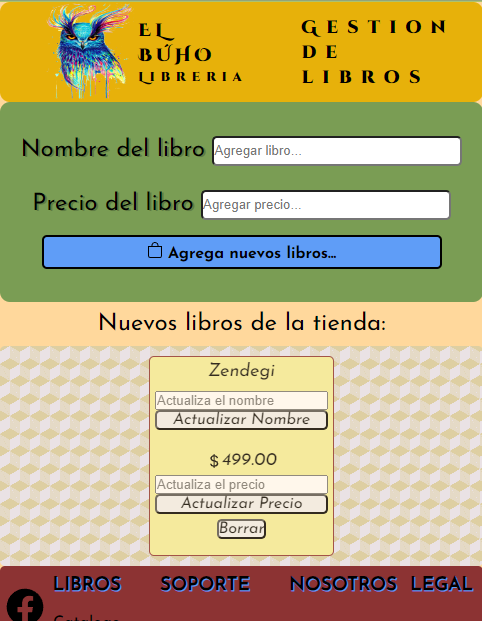

Proyecto numero 2 CRUD

En este proyecto se utiliza HTML CSS y JavaScript en un modelo MVC. Se hizo posible un proceso CRUD C - Create ("Crear"), R - Read ("Leer"), U - Update ("Actualizar"), D - Delete ("Borrar"); para la gestion de libros, tambien se incorporo el localStorage para preservar los datos en el navegador.

vista general de la pagina
